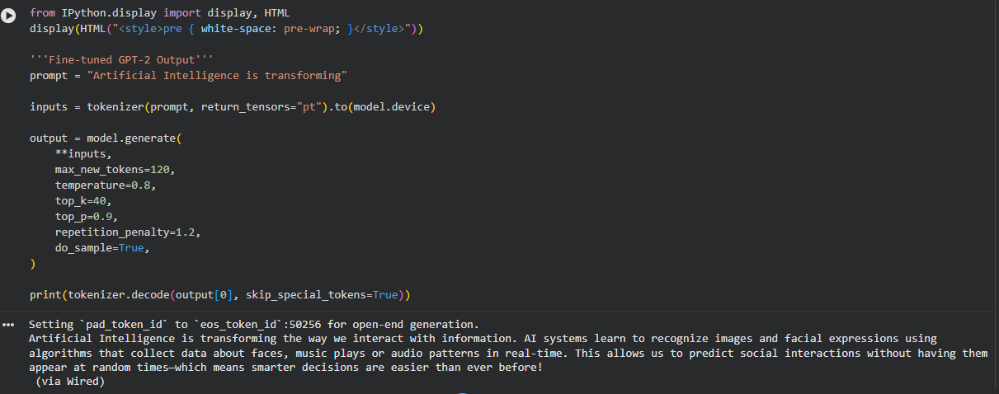

# GPT-2 Fine-Tuned Text Generator — AI Blog Generator

## Project Overview

This project demonstrates how a **pre-trained GPT-2 language model** can be fine-tuned on a custom dataset to generate domain-specific text.

The model is trained on a dataset of **Artificial Intelligence and technology blog content** so that it can generate coherent paragraphs related to AI, machine learning, and modern technology topics.

This project was developed as part of an **AI/ML internship task** to demonstrate understanding of:

* Transformer-based language models
* Dataset preparation for NLP tasks
* Fine-tuning pre-trained models
* Text generation using GPT-2

---

## Model Architecture

The project uses **GPT-2 Small (124M parameters)** from the HuggingFace Transformers library.

GPT-2 is a **transformer-based autoregressive language model** that generates text by predicting the next token in a sequence.

Fine-tuning allows the model to adapt its writing style and vocabulary to a **specific domain dataset**.

---

## Dataset

A custom dataset of AI-related blog paragraphs was created for training.

Topics included:

* Artificial Intelligence
* Machine Learning
* Deep Learning
* Natural Language Processing
* AI in Healthcare
* AI in Finance
* Automation
* Large Language Models
* Edge AI
* Computer Vision

Dataset location:

```
data/dataset.txt
```

Each paragraph in the dataset represents a **short AI blog-style explanation** used to guide the model toward generating technical content.

---

## Training Setup

Training was performed using the **HuggingFace Trainer API**.

Key training configuration:

| Parameter           | Value          |
| ------------------- | -------------- |
| Base Model          | GPT-2          |
| Epochs              | 3              |
| Batch Size          | 4              |
| Learning Rate       | 5e-5           |
| Evaluation Split    | 10%            |
| Max Sequence Length | 128            |
| Mixed Precision     | Enabled (FP16) |

Training was performed using **Google Colab GPU**.

---

## Example Prompt

```
Artificial Intelligence is transforming
```

---

## Sample Output

Below is an example output generated by the fine-tuned model.



*Example output generated by the fine-tuned GPT-2 model trained on AI blog content.*

---

## Project Structure

```
gpt2-text-generation-finetuning/
│
├── data/
│   └── dataset.txt
│
├── notebook/
│   └── GPT2_FineTuning_AI_Blog.ipynb
│
├── images/
│   └── sample_output.png
│
├── generate.py
├── requirements.txt
├── README.md
└── .gitignore
```

---

## Installation

Clone the repository:

```
git clone https://github.com/yourusername/gpt2-text-generation-finetuning.git
cd gpt2-text-generation-finetuning
```

Install dependencies:

```
pip install -r requirements.txt
```

---

## Running the Text Generator

Run the script:

```
python generate.py
```

Enter a prompt and the model will generate AI-related text.

Example:

```
Enter your prompt: Machine learning is changing the way
```

The model will generate a continuation based on the learned dataset style.

---

## Technologies Used

* Python
* PyTorch
* HuggingFace Transformers
* HuggingFace Datasets
* Google Colab
* GPT-2 Language Model

---

## Key Learning Outcomes

This project demonstrates practical skills in:

* Fine-tuning pre-trained transformer models
* Preparing and structuring NLP datasets
* Using HuggingFace Trainer API
* Evaluating language models
* Implementing text generation pipelines

---

## Future Improvements

Possible improvements for this project include:

* Training on a larger dataset
* Reducing repetition in generated text
* Deploying the model using a web interface
* Building an API for text generation
* Experimenting with larger models such as GPT-Neo or GPT-J

---

## Author

Developed as part of an **AI/ML internship task** to explore transformer-based text generation using GPT-2.
